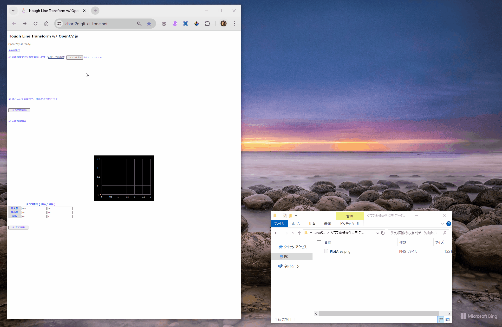

### Description

グラフ画像から点列データ抽出します。

### Usage

1. https://pic2digit.kii-tone.net/ へアクセスします。

2. グラフ画像が手許に無い場合は、手順①の「#サンプル画像」から一旦Downloadした後、①～④ の手順に沿うと、グラフ画像から抽出した点列データがCSV出力されます。（[ハフ変換](http://labs.eecs.tottori-u.ac.jp/sd/Member/oyamada/OpenCV/html/py_tutorials/py_imgproc/py_houghlines/py_houghlines.html)）

{ width=90% }
 
 

